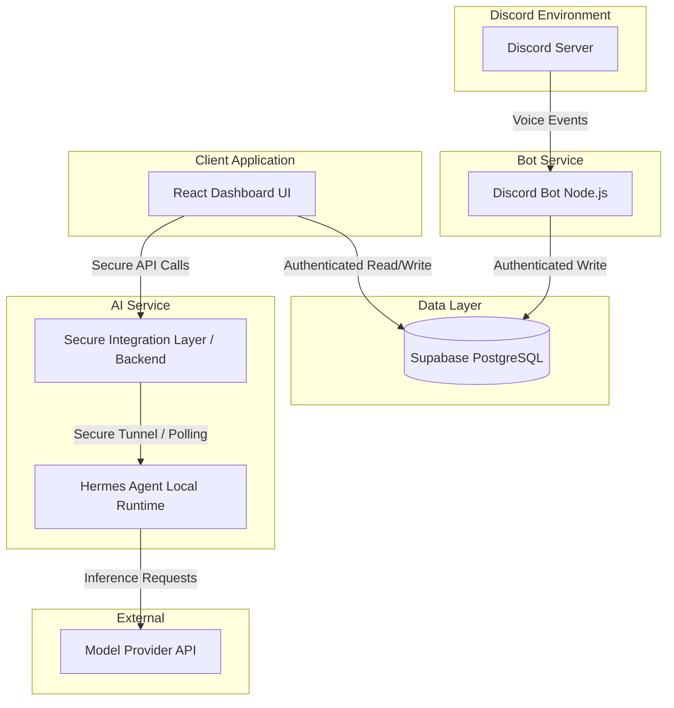

# Implementation Plan: TRIADICT Studio Management System

## 1. Project Overview
**Project name:** TRIADICT Studio Management System
**Team size:** Three members
**Primary objective:** Build a shared company management system with a personal dashboard for each team member displaying daily/weekly work analytics, tasks, learning activity, and relevant team info. Integrate Hermes Agent as a local AI assistant to help plan work, review activities, and improve time management based on real database records.

## 2. Current State and Verified Facts
Based on the inspection of the existing project structure and schema files:
* **Frontend:** React + Vite, routing, and Supabase client exist (`src/`, `vite.config.js`). Existing working authentication, task CRUD, and learning-log CRUD must be preserved.
* **Database (Supabase):** PostgreSQL database with `tasks`, `learning_logs`, and `profiles` tables. 
  * *Discrepancy noted:* `supabase_setup.sql` defines `user_id` for tasks/learning_logs, while `fix_rls_policies.sql` references `assigned_to` and `member_id`. The actual schema must be inspected before making any assumptions or standardizations.
  * *Unverified/Missing:* `voice_sessions` table does not exist in the examined SQL files. This must be created after schema inspection.
* **Discord Bot:** A separate Node.js project (`discord-bot/`) exists with `discord.js` and `@supabase/supabase-js` dependencies.
  * *Unverified:* Discord work-channel IDs and credentials are collected, but integration and join/leave event tracking is **not yet verified**.
* **Hermes Agent:** 
  * *Unverified:* Hermes Agent installation and configuration are not yet verified. It will run locally.

## 3. Target Architecture

## 4. Component Responsibilities
* **React Dashboard:** Display personal analytics, task management, learning log history, and assistant interface. Must not break existing working frontend queries.
* **Discord Bot:** Detect voice channel join/leave events, manage disconnects/restarts. **Startup Recovery:** Upon restart, the bot must reconcile its database state with current active Discord voice states, closing dangling sessions and initiating new ones if needed.
* **Supabase Database:** Central source of truth. Manage schema, store data, enforce Row Level Security (RLS) for data isolation.
* **Secure Integration Layer:** Intermediary backend to feed authorized data to Hermes without exposing raw database credentials.
* **Hermes Agent:** Generate insights, daily/weekly summaries, and task prioritization using context provided by the integration layer.
* **Model Provider API:** Provide LLM inference for Hermes.

## 5. Data Flow: Discord → Supabase → Dashboard
1. Member joins a designated work voice channel.
2. **Discord Bot** captures the `voiceStateUpdate` event, maps the user to a profile, and creates a `voice_sessions` record with a `joined_at` timestamp.
3. Member leaves or switches to a non-work channel.
4. **Discord Bot** updates the same `voice_sessions` record with a `left_at` timestamp.
5. **Dashboard** queries `voice_sessions` (via Supabase client) for the authenticated member.
6. **Dashboard** calculates daily totals and weekly averages locally using the fetched records, correctly handling midnight crossovers.

## 6. Data Flow: Dashboard → Integration Layer → Hermes → Model
1. Member asks the AI for a weekly summary on the **Dashboard**.
2. **Dashboard** sends an authenticated request to the **Secure Integration Layer**.
3. **Integration Layer** validates the session, queries Supabase for the member's tasks, learning logs, and voice sessions, formatting them into context.
4. **Secure Communication & Availability:** Because Hermes runs locally and the integration layer may be deployed to the cloud, communication is handled securely via a reverse tunnel (e.g., ngrok/Cloudflare Tunnel) or by having the local Hermes instance long-poll the integration layer for pending requests. The local service must **never** be exposed publicly without strict authentication. Additionally, **local Hermes is unavailable while its host machine is offline or asleep.** The implementation must handle unavailable requests with a clear error and timeout on the dashboard.
5. **Hermes Agent** securely calls the **Model Provider API**.
6. Response streams back through the Integration Layer to the Dashboard.

## 7. Database Entities & Relationships
*Before modifying the schema, actual existing frontend queries and table structures MUST be inspected. Column names will be standardized to match what is currently working in the frontend.*
* **`profiles`:** `id` (references `auth.users(id)`), `username`, `full_name`, `avatar_url`, `role`.
* **`tasks`:** `id`, `created_at`, `title`, `status`, `priority`, `[ownership_column]` (exact column name to be verified by schema inspection).
* **`learning_logs`:** `id`, `created_at`, `title`, `category`, `duration_minutes`, `[ownership_column]` (exact column name to be verified by schema inspection).
* **`voice_sessions` (Planned):** `id`, `[ownership_column]`, `discord_user_id`, `channel_id`, `joined_at`, `left_at`, `duration_seconds`.

## 8. Analytics Definitions and Formulas
* **Timezone:** Asia/Kolkata
* **Reporting Week:** Monday through Sunday. Partial weeks include data from Monday to the current day.
* **Midnight Crossover & Splitting:** If a session crosses midnight (e.g., joins at 11:00 PM, leaves at 1:00 AM), the calculation logic must split the duration, allocating 1 hour to "Yesterday" and 1 hour to "Today" to prevent skewed daily totals.
* **Live Session Duration:** `Current Time - joined_at` (for sessions where `left_at` is null). This adds to Today's Hours without double-counting.
* **Today's Recorded Work Hours:** Sum of completed sessions that occurred today + active live session duration (since midnight, if crossed).
* **Yesterday Comparison:** `Today's Recorded Work Hours - Yesterday's Recorded Work Hours` (accurately split at midnight).
* **Weekly Average:** Defined explicitly as total recorded work hours from Monday through the current day in Asia/Kolkata, divided by the number of elapsed calendar days in that reporting week. Days without recorded work count as zero. This definition must be kept consistent across the dashboard and AI summaries.

## 9. Security, Permissions, and Secret-Management
* **Row Level Security (RLS) & Authorization:** 
  * **Personal Records:** RLS policies must restrict `tasks`, `learning_logs`, and `voice_sessions` so users can only read/write their own records (`auth.uid() = [exact_ownership_column]`). We must not assume the foreign-key column is `user_id`. Phase 0 must inspect the actual schema and document the exact ownership column and corresponding RLS policies before any schema or policy changes.
  * **Team Summaries:** Explicitly permitted team summary views/functions must be defined. RLS bypasses for team stats should use `SECURITY DEFINER` functions or dedicated views granting read-only access for aggregated metrics, ensuring raw personal data is not inadvertently exposed.
* **Discord Bot:** Uses Supabase Service Role key (server-side only) to write session data. Token and keys stored in `.env`.
* **Hermes Agent:** Model Provider API key must reside locally in the backend/Hermes environment, NEVER in the React Vite bundle.
* **Dashboard:** Only uses the Supabase Anon key.

## 10. Implementation Phases with Acceptance Criteria

### Phase 0: Audit and Architecture
* **Tasks:**
  * Inspect the actual Supabase schema and working queries via Supabase Studio or CLI.
  * **Document the exact ownership column and corresponding RLS policies for each table before any schema or policy changes.** Do not assume the foreign-key column is `user_id`.
  * Standardize column names based strictly on what is currently working in the frontend.
  * Define the `voice_sessions` schema using the verified and standardized foreign key column.
* **Acceptance Criteria:**
  * Document mapping of exact working table columns and their associated RLS policies.
  * No code or schema changes made.
  * Finalized `voice_sessions` schema definition documented.

### Phase 1: Stabilize the Existing Dashboard
* **Tasks:**
  * Verify the existing authentication flow.
  * Verify task and learning log CRUD operations work perfectly with existing RLS.
  * Remove reliance on mock statistics in the UI.
* **Acceptance Criteria:**
  * User can log in and out successfully.
  * User can create, read, update, and delete tasks and learning logs.
  * A second test user cannot see the first user's tasks or learning logs.
  * No existing working features are broken.

### Phase 2: Discord Bot and Voice Tracking
* **Tasks:**
  * Configure environment variables and permissions.
  * Create `voice_sessions` schema in Supabase.
  * Implement join/leave tracking and Supabase insertion.
  * Implement bot startup recovery: on boot, reconcile the current active voice states in Discord with the database, closing dangling sessions or resuming active ones.
* **Acceptance Criteria:**
  * Joining a designated work channel creates a database row with `joined_at`.
  * Leaving the channel updates the row with `left_at`.
  * Restarting the bot while a user is in a voice channel correctly handles the session without duplicating or dropping it.

### Phase 3: Real Analytics
* **Tasks:**
  * Implement queries for `voice_sessions` in the dashboard.
  * Implement daily, yesterday, weekly formulas using Asia/Kolkata timezone, correctly splitting sessions crossing midnight.
  * Implement live timer for active sessions.
* **Acceptance Criteria:**
  * Dashboard accurately displays daily totals.
  * Sessions spanning midnight are correctly split across days.
  * Weekly average matches the strict "Monday through current day divided by elapsed calendar days" formula.
  * Active sessions update live without double-counting on refresh.

### Phase 4: Hermes Agent Setup
* **Tasks:**
  * Inspect and verify current Hermes Agent installation.
  * Run Hermes locally and configure the chosen Model Provider through an API key.
* **Acceptance Criteria:**
  * Hermes starts successfully on the local machine.
  * Test inference requests succeed via the Model Provider API.
  * API keys are verified to be stored securely.

### Phase 5: Hermes Data Integration
* **Tasks:**
  * Build the Secure Integration Layer.
  * Implement queries to fetch a member's context (tasks, logs, voice time).
  * Set up secure tunneling/polling so the cloud deployment can reach the local Hermes instance securely.
* **Acceptance Criteria:**
  * The integration layer successfully fetches data bounded by strict RLS rules.
  * Hermes can receive the context and prompt over the secure tunnel/polling mechanism and respond successfully.

### Phase 6: Dashboard and AI Assistant Integration
* **Tasks:**
  * Add a chat interface to the React Dashboard.
  * Connect chat to the Secure Integration Layer.
  * Implement graceful error handling with timeouts when the local Hermes instance is offline or unreachable.
  * Implement separated endpoints/logic for personal summaries vs. permitted team summaries.
* **Acceptance Criteria:**
  * User can chat with Hermes via the dashboard.
  * Hermes accurately answers based on the user's data.
  * The dashboard handles timeouts cleanly, displaying a clear error when Hermes is offline.
  * Hermes accurately produces team summaries based ONLY on explicitly authorized aggregate data.
  * Users cannot prompt Hermes into revealing other users' private task data.

### Phase 7: Deployment and Reliability
* **Tasks:**
  * Deploy Discord Bot to a reliable host.
  * Deploy Dashboard.
  * Formalize the secure connection (Tunnel/Polling) for the local Hermes instance, while acknowledging its offline limitations.
  * Treat persistent Hermes availability for all three team members as an explicit deployment decision requiring a permanent solution (e.g., cloud hosting or a dedicated server), rather than assuming a tunnel guarantees 24/7 access.
* **Acceptance Criteria:**
  * Bot runs continuously independent of the local machine.
  * Dashboard is accessible via web URL.
  * A concrete plan/decision is made regarding persistent Hermes availability for the whole team.

### Phase 8: Final Testing
* **Tasks:**
  * Execute Test Plan covering all edge cases.
* **Acceptance Criteria:**
  * All test cases pass successfully.

## 11. Testing Strategy
* **Unit/Integration:** Test analytics formulas with mocked timestamps covering timezone boundaries, midnight crossovers, partial weeks, and zero-hour days.
* **End-to-End (Bot):** Manually join/leave channels, disconnect internet, restart bot, verify dangling sessions are reconciled correctly with active voice states.
* **Security:** Attempt to fetch other users' `tasks` and `voice_sessions` via the dashboard to verify RLS. Verify `SECURITY DEFINER` functions only expose authorized team aggregates.
* **AI & Network:** Test Hermes with questions about work hours to ensure it uses exact database numbers. Test dashboard chat when the local Hermes host machine is offline to verify graceful error and timeout handling.

## 12. Deployment Strategy
* **Bot:** Cloud hosting to ensure 24/7 uptime, independent of local machines.
* **Dashboard:** Static hosting with environment variables for Supabase Anon Key.
* **Hermes/Backend Integration:** The integration layer can be hosted in the cloud (e.g., Supabase Edge Functions), communicating with the local Hermes Agent via a Secure Tunnel (e.g., Cloudflare Tunnel) or a long-polling client running alongside Hermes. The local service will not expose open ports to the public internet. *Note: The local Hermes agent will be unavailable when its host machine is offline. Persistent availability for all three team members is a deployment decision that requires an explicit solution (e.g., cloud hosting Hermes), not something a tunnel automatically guarantees.*

## 13. Risks and Mitigations
* **Risk:** Bot disconnects leave "open" voice sessions indefinitely.
  * **Mitigation:** Bot startup recovery reconciles current Discord voice states with the database, closing dangling sessions.
* **Risk:** Model hallucinates productivity judgments.
  * **Mitigation:** Strict system prompts instructing the model to only report data provided in the context layer.
* **Risk:** Local Hermes is unavailable when the host laptop is closed.
  * **Mitigation:** The dashboard implements a clear timeout and error message. The team must eventually decide on a persistent hosting strategy if 24/7 access is required.

## 14. Unresolved Decisions and Assumptions
* **Model Provider:** Which LLM provider (OpenAI, Anthropic, Gemini, etc.) will be used for Hermes?
* **Integration Layer Hosting:** Will we use Supabase Edge Functions or a standalone Node server?
* **Column Standardization:** Final exact ownership column names pending Phase 0 schema inspection.
* **Persistent Hermes Availability:** Will Hermes remain local with expected downtime, or move to a server for persistent, asynchronous access for all 3 members?

## 15. Final Implementation Checklist
- [ ] Schema inspected to verify exact ownership columns and corresponding RLS policies.
- [ ] Working frontend queries and CRUD operations preserved.
- [ ] RLS policies verified and Team Summaries strictly defined.
- [ ] Discord bot tracking voice states with startup reconciliation.
- [ ] Dashboard analytics using real data, accurately handling midnight crossover and zero-hour days in weekly averages.
- [ ] Hermes running locally with Model Provider.
- [ ] Integration layer communicating securely with local Hermes without public exposure.
- [ ] Dashboard AI interface fully functional and gracefully handling offline timeouts.
- [ ] Decision made and implemented for persistent Hermes availability.
- [ ] System successfully deployed.
